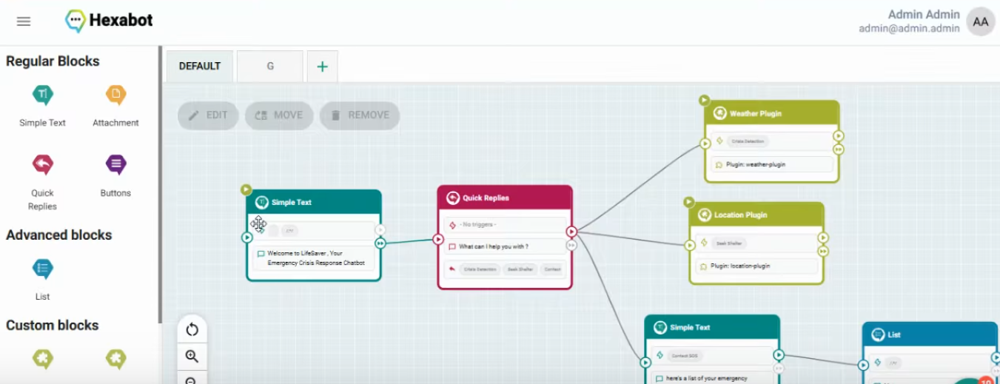

# Life Saver Hexabot Plugin

LifeSaver is a user-friendly chat bot app designed to assist individuals during natural disasters. It allows users to share their precise location with others, enabling quick assistance in emergencies. By analyzing real-time weather data, the app determines whether the user is in a safe or dangerous situation and provides immediate alerts.

Our team participated in the TN 2056 Challenge with our agritech startup, PREDICTI, it's an IoT-powered weather station that uses AI to provide accurate weather forecasts, helping farmers manage crises. 
Soon, PREDICTI will feature Life Saver Chatbot, offering real-time updates, personalized alerts, and critical assistance during extreme weather events. This integration will benefit both farmers and everyday users, expanding the app's impact beyond agriculture.

## Features

- **Crisis Detection:** Utilizes weather APIs to determine if you are in a crisis situation.
- **Shelter Guidance:** Identifies the closest shelter based on your location.
- **SOS Communication:** Enables contact with emergency services like police or personal SOS contacts.

## Workflow

Below is an image representing the workflow of the Hexabot application:

## Acknowledgments

Special thanks to Baha Eddine Hammou and Molka Weslati for this.

## Contact

For questions or feedback, please contact [Baha Eddine Hammou](https://github.com/baha-eddine-hammou).
